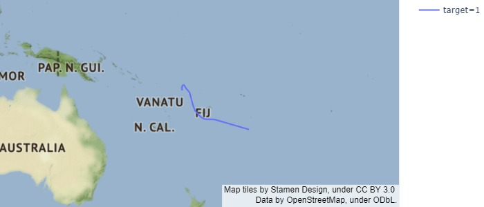
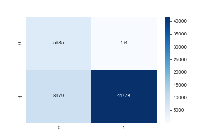

# Tropical Storm Classification Modeling Project

**Author**: [Christie Sarver](mailto:christie.sarver@gmail.com)

## Overview

The goal of this project is to build a model that takes in tropical cyclone tracking data and classifies accurately whether readings indicate that a storm is a severe Tropical Storm or a less disruptive disturbance.

### The Data

The data for this project is from the National Oceanic and Atmospheric Administration's International Best Track Archive for Climate Stewardship (IBTrACS) project. The goal of this project is make available tropical cyclone best track data to aid understanding of the distribution, frequency, and intensity of tropical cyclones worldwide.

Because IBTrACS is a global source, this data is pulled from many separate agenices worldwide, and therefore has many columns that are duplicative, inconsistent, or difficult to interpret. When doing this analysis, reference was made to the data documentation saved in this repository. The [Data Visualizations](./Data%20Visualizations.ipynb) notebook includes different ways of examining the features, as well as a function to map out the specific storms in the data set. 

[Source](https://www.ncdc.noaa.gov/ibtracs/index.php)

### Business Problem

The resulting model will be used by meterologists to understand whether an incoming storm is a major threat to a certain area, and therefore inform news agenices, local governments, and the public to prepare accordingly.



## Methodology

Due to the complexity of this data set, a large part of this project was cleaning and exploring the data with reference to its documentation, located in this repository. Before modeling, relevant features were selected including:
* Location-based indicators: latitude, longitude, basin, distance to land
* Weather conditions: wind speed, storm speed, storm direction
* Times of occurence: year, week of year

Several model types were run to determine the best methodology, with the primary scoring method of recall in order to reduce false negatives i.e. instances where a severe storm is misclassified as a non-threat. The model was also evaluated on accuracy & precision. 

## Results

Based on the model evaluations which are detailed in the notebook, the final model chosen to move forward with is a decision tree. The strenghts of this model include its high recall score as compared to others. It also can perfectly predict true positives. 

Areas where the model could be improved include overall accuracy, and precision in predicting true negatives, which is where most of the error comes from. The confusion matrix below shows this. 



### Business Objective Results 

The project achieved the goal of creating a model with an emphasis on a high recall score, which can be used to classify tropical storms. However, overall accuracy of the model should be improved.

### Conclusions & Future Work

The decision tree can be further tuned to reduce error. It is also recommended to revisit the feature selection to potentially remove more of the less trustworthy features to get better predictions.

This data set itself presented several challenges. For future work it is recommended to work closer with or take further time to examine/understand NOAA data and their methodology in order to improve data that is piped into this model. This may include examining the different sources of the data as well as the data gathering process.

Lastly, while this project analyzed individual readings in the data, it is recommended to analyze data grouped by storm if more instances of the 0 class are able to be added to the data set to take a more holistic look at storm patterns.

## For More Information

Please reference the [Jupyter Notebook](./Data%20Classification_Predicting%20Tropical%20Storms.ipynb) or review this [presentation](./Data%20Classification%20APresentation.pdf).

## Repository Structure

```
├── images
├── Data Classification_Predicting Tropical Storms.ipynb
├── Data Visualizations.ipynb
├── IBTrACS_version4_Technical_Details.pdf
├── Data Classification Presentation.pdf
├── README.md

```
Thank you!
